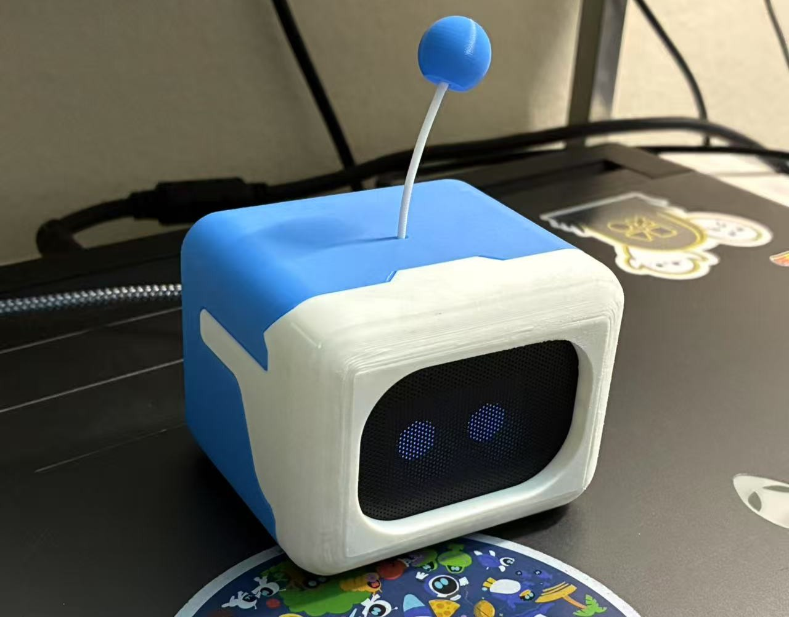
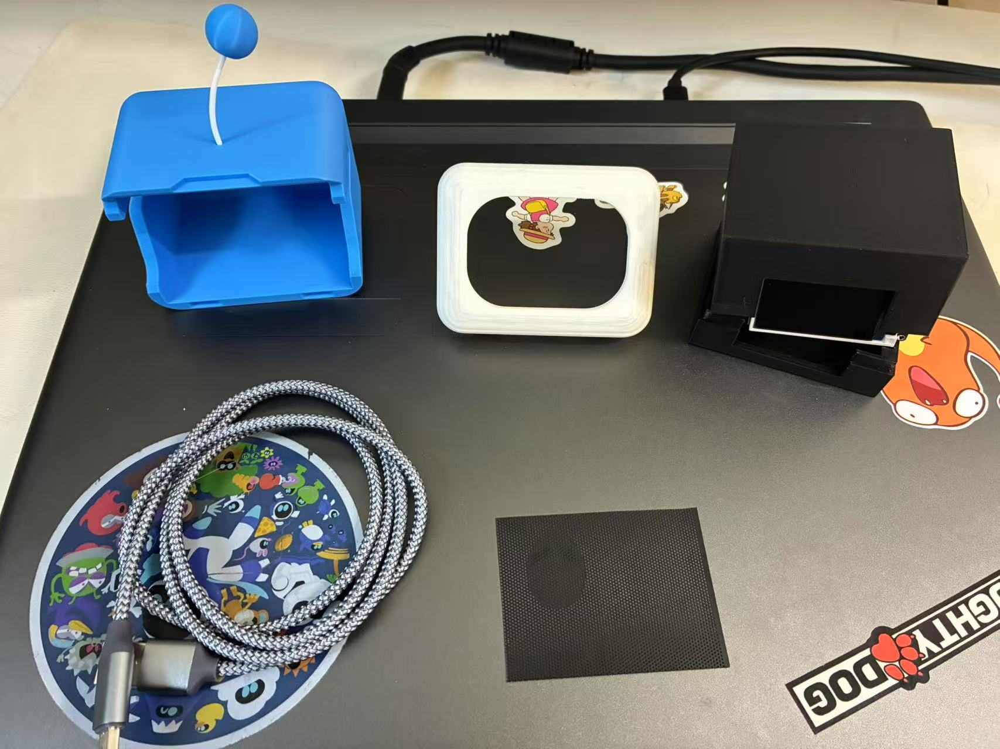

# Astrobot Clock

The **Astrobot Clock** normally switches between displaying the time and an Astrobot eye. When touched, it changes to a heart-shaped eye as a fun interactive feature.

## Components Used

- **Arduino Nano**  
- **Mini USB Cable**  
- **Timer Module**  
- **Vibration Sensor Module**  
- **1.8-inch TFT Screen**
- **[Amazon Link](https://www.amazon.com/dp/B0CZ9MWXYG?ref=ppx_yo2ov_dt_b_fed_asin_title&th=1) Black sheet for pixelated effect**

Video: https://www.youtube.com/watch?v=toD8v6Fiznk

