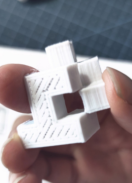

# Cube Converter - Blender Addon

It's a cubic converter for a specific case, the 3D printer.

https://docs.blender.org/manual/en/latest/advanced/scripting/addon_tutorial.html

https://docs.blender.org/manual/en/latest/advanced/scripting/addon_tutorial.html

### .cube file

Separator is '\n', '\t' & ','

Example,

> 0,1,0	0,1,0
> 0,1,0	0,1,1