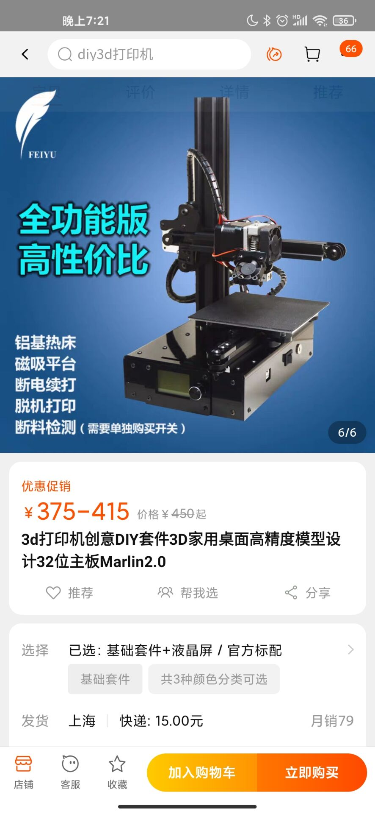
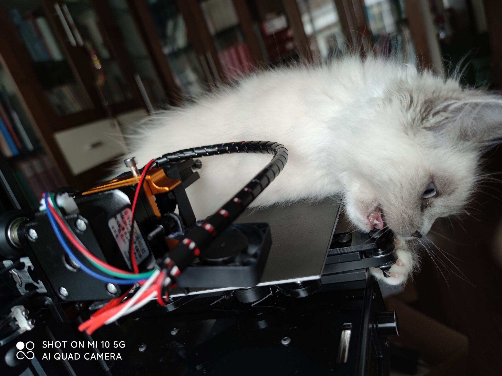
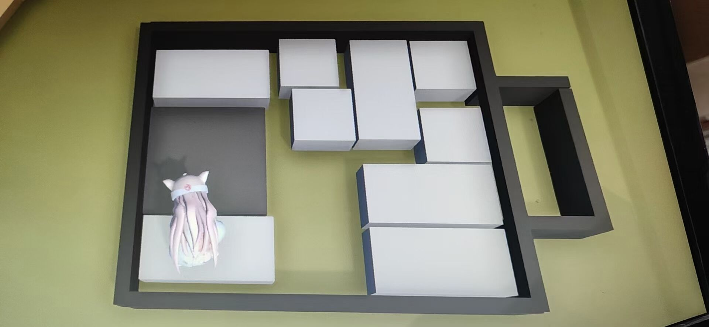
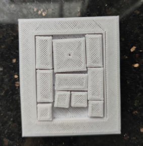
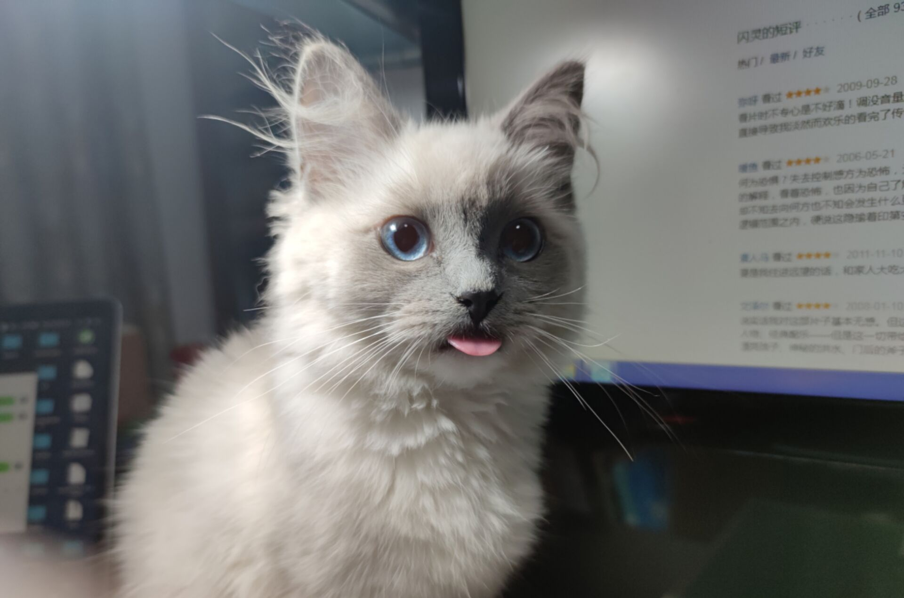

想找个地方记录一下整个开始的过程

---

一开始是19年的时候，闲着无聊在翻YouTube，看到了一些（巨贵的）puzzle模型。然后自然而然的思考有没有廉价一点的替代，于是翻到了3D打印的模型。不过后来因为不太熟悉流程所以也没有走淘宝代打印的道路。

和朋友交流的过程中（指点下了）了解了一些些图形学做这些Puzzle自动化生成的，并且在参考文献中翻到了一个挺好的整理网站（到现在也就是PuzzlingWorld那个section的参考网站）。

> 具体的记录在这里啦。
>
> https://blog.csdn.net/birdy_/article/details/89034098

后来就没有然后了。

---

两年后，因为疫情在家，突然就又想起了这个事情。

感觉也是时间久了逐渐有廉价的3D打印机了。我当时在淘宝搜了一下然后冲动下单了。

.

（这个卖家超好。。我买了几个月了还一直在问模型之类的问题）(但是它为什么我一买完就降价！生气)

拼了一天多，然后后面一直在debug……感觉硬件和机械的bug充满了我无法理解的部分。出现过的问题比如正负极装反了风扇不转，风扇不转然后料从奇奇怪怪的角度挤出来了；支撑架装歪了然后打出来斜的；打一半突然不出墨了（现在还有这个问题）；有时候开始打印了还会发现哪里固定松了……

我建议如果真的想打一些大型的东西还是不要买自己组装的了。我每次打印还要看看它会不会半路罢工QwQ

【朋友买了个2k左右的打印机，感觉效果很好，纹理不是很明显】

这是装好的样子。勉强能跑吧（

---

这之后还有个小插曲，就是我试了试写人类一败涂地的插件。然后我在里面加了一个华容道。

链接在这里。

https://steamcommunity.com/sharedfiles/filedetails/?id=2428018862

大家纷纷感慨华容道过难（怎么和我小时候玩过的华容道不是一个东西）

其实我也玩不出来233 我画了三四张草稿就是没测到这一关的结局（。）

这也让我觉得Puzzle是一个非常有趣的领域吧。而且华容道买一个也要20多块钱呢，自己建模的话就很简单了。

最后长这样 虽然打印精度很差但是勉强可以满足测试需求。。

----

刚开始尝试的时候我没打算自己建模，因为嫌麻烦。然后我在网站上找了这个。

https://www.myminifactory.com/object/3d-print-puzzle-65056

看着很合适。很好。直到我快要打完了才发现这个根本拼不起来嘛！！

太过分了嗷呜。

感觉如果真的想要有自己的参与感最好还是自己建模吧。

然后就有了CubeConverter这个blender插件。用它可以生成一些简单的立方形结构，比如华容道和孔明锁。打算以后慢慢补充内容。

不过我的动力应该全都是“这个怎么可能拼不出来”“我怎么就是拼不出来”的智障朋友们。啦啦啦。

---

好，都读到这里了再看看我的猫吧

